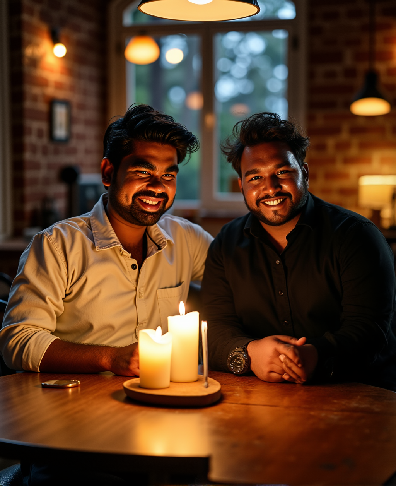

# Dual-Character-Fusion-Creating-a-Merged-AI-Portrait

### Workflow Description

This ComfyUI workflow is a powerful tool for generating and editing images with high precision. It uses a multi-stage approach, combining person-specific LoRA models to generate a base image and then performing a targeted inpainting process to add a second person to the scene. This workflow is ideal for creating customized images of specific individuals in a controlled environment.

---

### Key Features of the Workflow

* **Custom Character LoRAs**: The workflow utilizes two distinct LoRA models, trained on the faces of Vijay and his friend Sai. The trigger words `vik man` and `asm man` are used to activate their respective models.
* **Initial Generation**: In the first stage, the workflow generates an image of a person (Vijay) using the `vik man` LoRA model. This model is connected to the initial CLIP prompt, ensuring only Vijay's face is generated in the first pass.
* **Florence-2 Inpainting**: The workflow leverages a **Florence-2** model for inpainting. This model is used to accurately identify a person in the image and create a precise mask, which is crucial for the next step of adding a second person.
* **Segmentation and Masking**: A segmentation node is attached to the mask output from the Florence-2 model. This allows for automated and precise masking of a person in the image.
* **Targeted LoRA Inpainting**: In the second stage, the `asm man` LoRA model is connected to the inpainting process. With the mask applied, the workflow generates a new image within the masked area, replacing the original person with Sai's face.
* **High-Quality Upscaling**: After the inpainting process is complete, the final image is upscaled to a higher resolution, ensuring a clear and detailed output.

### How It Works: A Step-by-Step Guide

1.  **Initial Image Generation**: The workflow begins by generating an image based on a prompt that includes the trigger word `vik man`. This activates the corresponding LoRA model to create an image of Vijay.
2.  **Subject Segmentation**: The generated image is fed into a **Florence-2** model, which intelligently identifies and segments a person, creating a precise mask. This mask is then refined by connecting it to a segmentation node.
3.  **Inpainting with a New LoRA**: The masked area is targeted for inpainting. In the prompt for this second stage, the trigger word `asm man` is used. A dedicated `asm man` LoRA model is connected to this stage, ensuring that Sai's face is generated specifically within the masked area.
4.  **Final Upscaling**: The final composite image, now featuring both Vijay and Sai, is passed through an upscaler to enhance its overall quality and resolution.

This sophisticated workflow provides a streamlined way to combine multiple custom LoRAs and use advanced inpainting techniques to achieve complex, multi-person compositions that are difficult to create with simpler methods.

### Examples

